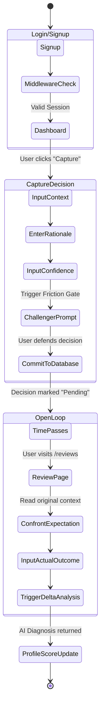

# Astra Mind: Project Status & Architecture Manifest

## 1. Project Overview
Astra Mind is a localized "Decision Memory Engine" built to fight impulsive reasoning and cognitive dissonance. By logging decisions before they play out, forcing users through friction-heavy "Commit Gates," and analyzing the delta between *Expected* and *Actual* outcomes via AI, the system serves as an unalterable ledger of human judgment. 

The ultimate goal is to provide users with a "Calibration Score" that accurately reflects how well their foresight aligns with reality.

---

## 2. Current Shipping Status

### ✅ Fully Implemented (Shipped)
* **Supabase Authentication**: Integrated SSR (Server-Side Rendering) authentication using `@supabase/ssr`. 
* **Custom Security Guardrails**: Middleware enforced routing, disposable email domain blocking, and alphanumeric password regex enforcement.
* **Database Triggers**: Custom PostgreSQL triggers that automatically copy demographic data (Name, Profession, Country) from auth metadata directly into a secure `public.users` table.
* **User Profiles**: Dynamic dashboard fetching user demographics, live Calibration Score, and Total Decisions metric. Secure session termination via Server Actions.
* **Capture UI**: A multi-step form capturing deep context (Rationale, Expected Outcome, Confidence).
* **Open Loop Reflection UI**: A dynamic module that pulls the most recent pending decision to constantly remind the user to log outcomes.
* **Pending Reviews Loop**: A dedicated interface (`/reviews`) where users must face their past decisions, submit actual outcomes, and rate their success out of 100.

### 🚧 In Progress / Next Steps
* **Delta Analysis AI**: Wire up the Gemini API backend endpoint to automatically read the "Actual Outcome" submission and stream back a brutal, objective diagnosis.
* **Calibration Algorithm**: Implement the math that takes the user's initial Confidence Level vs. Actual Success Rating and updates their global Calibration Score in Supabase.
* **Dashboard Analytics**: Build out the charting visualizations on the profile page to show Calibration Score history over time.

---

## 3. Core User Workflow



---

## 4. Technical Architecture

```mermaid
graph TD
    A[Next.js Client UI] -->|Server Actions| B(App Router Backend)
    A -->|API Routes| C(Gemini AI Route)
    B -->|@supabase/ssr| D[(Supabase Auth)]
    B -->|PostgREST API| E[(PostgreSQL Database)]
    
    D -.->|Database Trigger| E
    
    subgraph Data Models
    E --> F{public.users}
    E --> G{public.decisions}
    end
    
    subgraph AI Pipeline
    C --> H[Google Gemini Model]
    H -->|Delta Diagnosis| C
    end
```

### Table Definitions
1. **`users` Table**
   - `id` (UUID, linked to Auth)
   - `full_name`, `profession`, `country`
   - `calibration_score` (Int, defaults to 50)
   - `total_decisions` (Int, auto-incrementing)

2. **`decisions` Table** (Assumed Schema)
   - `id` (UUID)
   - `user_id` (FK to users)
   - `context`, `rationale`, `expected_outcome`, `confidence`
   - `actual_outcome`, `success_rating`
   - `status` (Enum: pending, resolved)
   - `ai_diagnosis` (Text)
